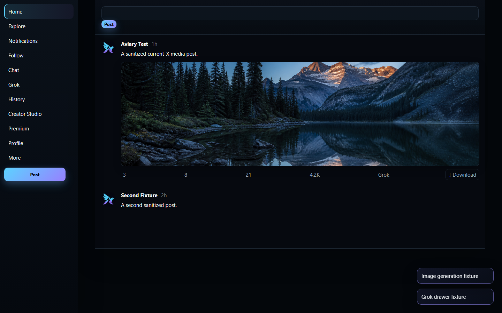
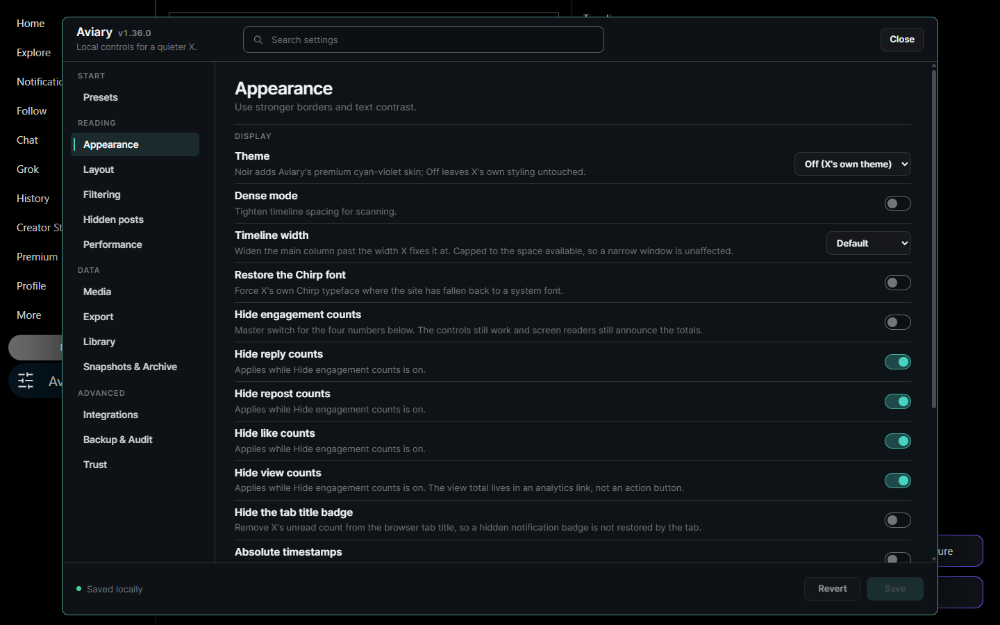
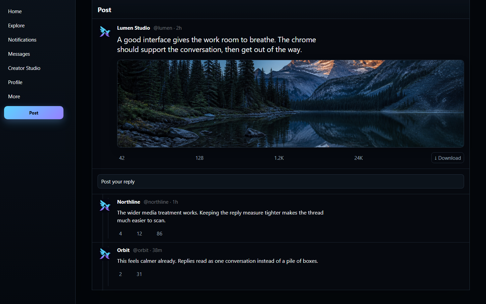

# Aviary




Aviary is a local-first X/Twitter enhancer. It adds clear image and video downloads, removes ads, and keeps its controls in a compact Control Center. Install it as a readable userscript or a Manifest V3 extension for Chrome and Firefox.

## Ad-free with media saves ready by default

Fresh installs remove advertising and enable one clear Download action on every media post, plus
per-asset Save, Thumb, and eligible Video/GIF controls.
Download history stores hashed media identities instead of source URLs. It catches alternate X
image sizes and exact byte matches, with optional visual matching for re-encoded images.
Saved media gets a quiet marker on the post. You can also write a text or JSON companion beside a
completed download, or use the current Library search to download media from captured records.
That Library batch uses only URLs already stored locally and does not request another X timeline.
When X has already exposed a direct audio track or caption file, the same post controls make those
files downloadable too. The Media page can export a date-bounded copy of download history without
including source media URLs.

Library also reads the monthly JSON that eligible accounts can download from X's Under the Hood
page. It keeps the report period and aggregate visibility labels locally, compares saved months,
and includes the normalized reports in a full library backup. The panel identifies the file as X's
own summary. It does not turn published ranking code into a production score.

The Control Center, menus, review dialog, and feedback toast use the browser Popover API. That
keeps them above X's layout without a z-index fight, dismisses them by clicking outside, and
returns focus to the control that opened them.
The media controls act only after you click them and can be disabled from Media at any time. Other
settings that change ordinary X content or styling still start off. That includes themes, layout
cleanup, filters, offscreen video pausing, and general analytics refusal.
Outside those download affordances, Aviary adds only its launcher to X's primary left navigation.

`tests/vanilla-by-default.test.mjs` measures this rather than asserting it: with default settings
it mounts the real theme code against an organic captured timeline and requires non-ad computed
styles to come back byte-identical. Ad-specific fixtures separately verify structural removal.

Already configured it and want to start over? **Trust → Reset everything to plain X**. That resets
preferences to Aviary's minimal ad-free baseline; saved posts, notes, bookmarks and download
history are kept.

Aviary does not touch sensitive media. It cannot reliably tell those posts from any other post.
X's own filter is left to do its job.

## Current Status

- Userscript entry: `src/entrypoints/userscript.ts`
- MV3 content entry: `src/entrypoints/extension-content.ts`
- MV3 background entry: `src/entrypoints/extension-background.ts`
- MV3 promoted-logger rule: `src/extension/ad-rule.ts` (dynamic, synchronized to
  `privacy.blockAds`; Firefox uses an event-page background plus an empty static compatibility set)
- MV3 page-world entry: `src/entrypoints/extension-page.ts` (declared `"world": "MAIN"`; the userscript reaches the same place through `unsafeWindow`)
- Page bridge and agent: `src/platform/page-bridge.ts`, `src/page/page-agent.ts`
- Document-start ad protection: `src/features/privacy/ad-protection.ts` plus the page-agent's exact
  promoted-content logger guard
- Stable selector registry: `src/platform/selectors.ts`
- Settings/storage foundations: `src/platform/settings.ts`, `src/platform/storage.ts`
- Layout declutter, theme, and scoped custom CSS foundations: `src/features/layout/declutter.ts`,
  `src/features/appearance/theme.ts`, `src/features/appearance/custom-css.ts`
- Filter engine and predicates: `src/features/filtering/filter-engine.ts`, `src/features/filtering/predicates.ts`
- Catch-up digest: `src/features/filtering/catch-up.ts`, `src/features/filtering/catch-up-ui.ts`
- Hidden posts: `src/features/filtering/hidden-posts.ts` (store), `src/features/filtering/hidden-posts-feature.ts` (Hide button + collapse)
- Media downloads: `src/features/media/` (`media-buttons.ts`, `urls.ts`, `template.ts`, `sidecar.ts`, `history.ts`, `queue.ts`, `download-watch.ts`, `downloader.ts`, `extract.ts`, `video-extract.ts`, `media-presentation.ts`, `batch-downloader.ts`)
- Export core: `src/features/export/` (`export-feature.ts`, `collector.ts`, `formatters.ts`, `assets.ts`, `viewer.ts`, `zip-store.ts`, `zip-reader.ts`, `jobs.ts`, `query-discovery.ts`, `network-capture.ts`, `xlsx.ts`, `warc.ts`, `wacz.ts`, `wacz-signing.ts`, `wacz-worker-client.ts`, `external-targets.ts`, `types.ts`)
- AI: `src/features/ai/command-menu.ts` (local prompt builder; optionally runs through `features/integrations/ai-provider.ts` when the user supplies an API key)
- Integrations: `src/features/integrations/` (`aria2.ts`, `crosspost.ts`, `ai-provider.ts`, `semantic-search.ts`, `usage.ts`)
- Library: `src/features/library/` (`user-notes.ts`, `link-unshorten.ts`, `snapshots.ts`, `snapshots-feature.ts`, `archive-import.ts`, `cleanup-preview.ts`, `cleanup-queue.ts`, `reports.ts`, `local-search.ts`, `bookmarks.ts`, `bookmark-capture.ts`, `bookmarks-feature.ts`, `under-the-hood.ts`)
- Composer: `src/features/composer/composer-snippets.ts`
- i18n: `src/platform/i18n.ts` + `src/features/core/i18n-feature.ts`
- Presets: `src/features/core/presets.ts`
- Core utilities: `src/features/core/` (`control-center.ts`, `selector-health.ts`, `audit-log.ts`, `settings-migration.ts`, `library-backup.ts`)
- Fixture tests: `tests/*.test.mjs`

## Desktop settings

All 13 Control Center destinations and the extension permissions page share one desktop cockpit
system with a fixed rail, grouped navigation, flat control rows, explicit dependencies, keyboard
focus treatment, and reduced-motion support. Settings stay in an isolated page draft until the
sticky Save control commits the whole page once; Revert restores the saved values, and navigation
is guarded while a draft is open. The primary verification viewport is 1440×900, with a 1920×1080
wide check.



## Premium Noir theme

Choose **Appearance → Theme → Noir** for Aviary's authored dark desktop skin. It gives the full X
shell a near-black blue base, subtle cyan/violet light, a continuous flat timeline, a quieter
navigation rail, refined composer/search surfaces, and restrained action highlights. Noir uses
semantic roles and stable X test ids rather than generated classes, avoids page-wide blur on the
infinite timeline, and remains opt-in: choosing **Off (X's own theme)** removes every Aviary paint
hook and restores the site's styling.

Timeline width now has two useful desktop tiers. Comfortable keeps X's discovery rail beside a
920px reading column. Wide centers a 1120px media canvas and removes the rail, so photos, video,
posts, and replies use the space instead of leaving a dead strip. Text remains capped to a readable
measure. On post pages, the focal post is larger and replies form a compact connected stream.



All six authored dark palettes now repaint the semantic shell and readable timeline surfaces even
when X itself is set to a light host theme. Automated coverage switches every palette across both
host themes at 1440×900 and 1920×1080, checks text contrast and overflow, and proves that Off
restores the host exactly.

Appearance also includes an optional Custom CSS editor for posts, media actions, navigation, the
sidebar, and the composer. Each rule stays local to the selected surface, refuses remote imports,
and is capped before it is saved. These are power-user overrides, so Trust calls out that support
cannot reproduce their visual effects.

## Focused Home

Layout now offers independent controls to hide Home's quick composer and Who to follow cards.
Hide trends collapses the complete current news/trend cards instead of leaving headings or empty
shells, Hide Grok also catches its sidebar promotion and floating Chat drawer, and navigation
cleanup understands X's current Follow, Chat, Grok, History, Creator Studio and Premium destinations. The Minimal
preset combines those reductions with a comfortable-width Noir timeline while keeping every
choice reversible.

## Development

```powershell
npm ci --ignore-scripts
npm run verify
```

Aviary has zero runtime dependencies, so nothing it ships needs an install script to build or run.
`--ignore-scripts` closes the install-hook attack class at no cost here. The build and full test
suite pass on a clean install without them. This matters because the 2026-08-04 ChainDrop worm
poisoned `keyv`, `flat-cache` and `file-entry-cache`, which ESLint pulls in here. It ran from a
`preinstall` hook. This repository resolves all three packages below the poisoned releases.

It is not blanket protection, and claiming otherwise would be the kind of statement this project
fails its own build over. Several 2026 compromises, chalk/debug among them, put the payload in the
module body, where no install flag reaches. What covers those is having no runtime dependencies at
all and installing from a committed lockfile with `npm ci`.

Node 22.23.2 or newer is required. This is the first line clear of the June and July 2026 Node
security releases. The `engines` range names supported lines explicitly. An open `>=` would also
admit Node 25.x, which reached end of life on 2026-06-01.

`npm run verify` type-checks the TypeScript source, runs fixture/source contract tests, and builds:

- `dist/aviary.user.js`
- `dist/extension-chrome/`
- `dist/extension-firefox/`

`npm run test:matrix` runs the deterministic release matrix separately: every supported route,
locale, theme, keyboard/coarse-pointer mode, malformed input class, provider response class, and
subscription lifecycle is reported locally before the headed smoke lanes.

Accessibility is checked two ways, because neither covers the other. `tests/a11y-behaviour.test.mjs`
drives the panel for focus entry and return, containment, Escape, modal semantics, and an accessible
name on every control. `tests/a11y-axe.test.mjs` runs axe-core over all 13 Control Center
destinations for invalid ARIA, missing names and contrast, scoped to Aviary's shadow root so it
never reports X's own DOM. Axe covers roughly half of accessibility issues by volume and none of
the judgement calls. No axe rule covers forced-colors breakage, so
`tests/forced-colors.test.mjs` carries that separately.

`npm run test:visual` rebuilds the extension and compares 60 desktop settings screenshots: all 13
Control Center destinations plus extension permissions at 1440×900 and 1920×1080 on dark and light
X hosts, with focused, invalid, saved, reduced-motion, and disabled-permission states. The reviewed
limit ignores per-channel deltas up to 24 and allows at most 1% changed pixels, enough for glyph-edge
antialiasing without accepting a moved card or missing footer. After intentionally reviewing a UI
change, regenerate the committed baselines with `npm run test:visual:update`.

`npm run capture:theme -- <output.png> <width> <height> <theme> [default|comfortable|wide]
[home|status]` captures any authored palette and reading surface. For example,
`npm run capture:theme -- docs/audit/noir-thread.png 1440 900 noir wide status`. Theme ids are
`dim`, `lightsOut`, `graphite`, `plum`, `midnight`, and `noir`.
`npm run capture:settings -- <output-directory> <width> <height> <dark|light>` uses the same
deterministic settings harness for ad-hoc captures.

## Privacy Model

Aviary is designed to keep account data local. It sends no telemetry, never reads or exports cookies or auth headers, and loads no remote code. Credentials you enter for optional integrations are stored locally and are redacted when you export settings.

AI and embedding calls are opt-in and show the destination, fields, estimated size, retention
notice, network status, and budget before provider work begins. Per-request and daily UTF-8 byte
limits are configurable in Integrations; profile-scoped usage history stores counters only, never
API keys or raw prompts. Local-only mode and disabled integrations make zero provider requests.

Aviary can also refuse X's general analytics beacons, the tracking pings sent as you scroll,
click and pause. That broader privacy control is off by default. Ad protection is separate: the
userscript answers only X's exact promoted-content logger locally at document start, while the
extension blocks the same URL before a connection through one host-scoped dynamic request rule.
Timeline, media, login, and unrelated analytics traffic stay untouched. Turning off **Block ads**
removes the dynamic rule immediately; turning it back on restores it, including after restart.

## Desktop ad protection

- Starts at document start in both the userscript and MV3 builds and is enabled by default.
- Prevents the separable `/i/api/1.1/promoted_content/log.json` event from reaching the network
  through page `fetch`, XHR, or `sendBeacon`.
- Removes native `Ad` units, paid partnerships, promoted trends, Grok/Premium house promos, and
  visible video-ad containers, then collapses the owning timeline cell so no reserved gap remains.
- Re-runs after client-side navigation and delayed timeline insertion, and reverses cleanly when
  disabled.
- A minimal synthetic corpus in `tests/fixtures/ad-corpus/` locks those structures without storing
  handles, post text, account/tweet ids, media, credentials, response bodies, or remote assets.
- Trust keeps a local, profile-scoped ring of at most 64 ad-marker observations for 30 days. Each
  entry contains only a route category, timestamp, and native/trend/house-promo/video counts. If a
  marker previously seen on that route disappears, selector health reports the contract drift;
  **Reset ad observations** clears the ring and warning.
- Does not block HomeTimeline. X delivers native sponsored records in the same essential
  first-party response as ordinary posts, so those bytes are inseparable and only their rendering
  can be suppressed safely.

Aviary does not encrypt its local data, and deliberately offers no setting that claims to. Its vault sits in the same browser profile as X's own session cookie, auth token and cached media, none of which Aviary can encrypt, all of which are more sensitive than its copy. Use full-disk encryption, which covers all of it.

See [docs/PRIVACY.md](docs/PRIVACY.md) for the local data map and optional permission notes.

## Filtering

The Control Center "Filtering" section exposes:

- Master toggle for all filter rules.
- Field rules with optional titles, expiry windows, and hide or dim actions.
- Portable plain-text rule sets with a preview before adding or replacing anything.
- Keyword and regex rule lists (one per line; `/pattern/flags` or bare patterns, case-insensitive by default).
- Whitelist of handles that are never filtered.
- Premium/verified action selector (off / hide / dim).
- Photo, video, and GIF media-type filters.
- Per-route activation chips (Home, Status, Profile, Search, Notifications, Messages).

Filters process only tweet articles added by MutationObserver and re-evaluate existing tweets when rules change. Disabling the master toggle removes every visible filter effect without a reload. Portable sets keep titles and expiry windows, and the same rules remain part of settings exports and full library backups.

Blocked-account (F032) and self-repost (F033) filters are deferred until an authenticated fixture capture lands; their settings keys are reserved.

## Hidden Posts

Every post carries a **Hide** control next to its More menu. Clicking it records the post locally and collapses it for good, so the following post is promoted into the slot instead of leaving a gap, you can clear a timeline by tapping Hide rather than scrolling past.

- Posts are keyed by status id. Posts without a `/status/` link (promoted units, some cards) fall back to a handle + text signature so the same unit stays hidden after a refresh.
- Hiding collapses the owning `[data-testid="cellInnerDiv"]` row, not just the article, because X positions timeline rows absolutely inside a measured container. A single coalesced `resize` event lets the virtualizer close the gap without moving scroll position.
- A toast with **Undo** appears after each hide; the Control Center also offers "Undo last hide", per-post Restore for the eight most recent, and "Clear hidden posts".
- Storage key: `aviary.hiddenPosts.v1`. The oldest entries are dropped once the store passes "Maximum remembered posts" (default 5000, range 100-50000).
- The Control Center "Hidden posts" section controls the master switch, the per-post button, per-route activation, and the cap. Turning the master switch off reveals everything again without forgetting anything.

## Catch-up digest

Filtering can keep a bounded local copy of posts Aviary has already rendered. The Control Center
opens a digest for the last 1, 2, 4, 6, 8, or 12 hours, plus an older-than-12-hours view. It can
sort by time, density, or author, group rows by author, show top links, and open the original post.
The default view leaves filtered rows out of the main count; the Filtered view keeps each rule's
reason visible.

Catch-up never marks anything read, requests another timeline, or claims to know what X did not
render. It stores a bounded copy of the rendered text, account, permalink, media references, and
basic engagement counts for up to 4,000 posts or 30 days. **Filtering → Dim posts you have already
seen** enables the companion store. **Forget seen posts** clears both the id-only seen ledger and
the catch-up copies. Media references stay inert until you click a preview.

## One-click media

The Control Center "Media" section exposes:

- Default-on master toggle for one persistent post-level Download action plus per-asset Save / Thumb / eligible Video and GIF buttons.
- Original-quality preference (`name=orig` first, then `4096x4096` only if the original transfer fails).
- Filename template with `{handle}`, `{account}`, `{tweetId}`, `{mediaId}`, `{index}`, `{total}`, `{date}`, `{text}`, `{ext}` fields.
  `{handle}`, `{text}` and `{tweetId}` follow the media's owner, so a photo saved out of a quoted
  post carries the quoted account's handle and text. `{account}` is an alias for `{handle}` and is
  useful as a folder segment when you want files grouped by publisher. Where X renders no permalink inside the quote
  card and no captured record supplies its id, `{tweetId}` falls back to the post the asset was
  found in -- the handle is the ownership claim, and it is never the wrong one.
- Duplicate history with hashed asset and content signatures, plus a "Clear download history"
  action. Short-lived hashed claims stop two open X tabs from starting the same transfer together.
- Live status readout (running / completed / duplicate / failed) and the size of the dedup index.

Downloads prefer `GM_download` in userscript managers, fall back to the extension service worker (`chrome.downloads` with `conflictAction: uniquify`), and finally use an anchor tag when no privileged downloader is available. Image candidates stay in quality order; the extension persists the bounded fallback while a download is active so an interrupted `orig` transfer can resume at `4096x4096` after its service worker wakes again.

The post action sits beside X's native controls and downloads every attached photo, direct video/GIF,
audio track, and caption file in one click, excluding video thumbnails and anything that is not the
post's own media.
A quoted post's photos and a link card's preview belong to somebody else: each keeps its own Save
control, saved under the account that actually published it, and the post action says in its
accessible label that it is saving only the post's own media. It remains labeled on desktop and contracts to
a 44-pixel icon action on narrow touch screens. The per-asset overlay remains for selective saves.
Both controls report resolving, Saving, Started, Saved, Queued, Allow, or Retry in place, expose
busy state to assistive technology, preserve completed assets across a partial retry, and return to
their original action after feedback. **Started** and **Saved** are separate for a reason: the
browser's download API acknowledges a handoff, not a completed file, so in the extension build the
control reads Started until the browser reports the transfer's terminal state. An interrupted
transfer reads Retry, and is never written into the duplicate history, which is what makes the
retry possible. Failed claims are released immediately, while a tab that disappears cannot block
the file after its claim expires. The tracking survives the service worker being suspended
mid-transfer. The MV3 build also adds **Download media with Aviary** to X's native right-click menu. The
page-side handler maps the clicked player back to Aviary's captured direct variant, so X's
MediaSource `blob:` playback handle is never mistaken for a file.


In the MV3 build `downloads` remains an optional permission. Choosing the native right-click action
requests it from that explicit browser gesture and immediately continues the save when granted.
Until it is granted, an on-post button reads **Allow** instead of claiming a save and opens Aviary's
options page. That page (toolbar icon, or Extensions → Aviary → Options) shows the live grant state
for `downloads` and for the `pbs.twimg.com` / `video.twimg.com` media hosts, makes download access
the recommended first step, and can revoke either. Permission checks and results are announced,
and the setup remains usable in compact extension windows.
On the rare path where the anchor fallback still runs for a cross-origin URL, the button reads
**Opened**, not Saved. The userscript build is unaffected.

Tweets with embedded video or GIF players expose a Video / GIF button when Aviary's page-world
GraphQL capture finds a direct downloadable variant. X commonly gives timeline players a `blob:`
MediaSource URL, so blob-only players intentionally have no video control; a known poster still
gets its Thumb control. Aviary keeps only bounded media metadata, matches it to the tweet/media,
and picks the highest-bitrate complete progressive MP4 it can save. Capture covers both `fetch`
and `XMLHttpRequest`, which X currently uses for HomeTimeline. HLS/DASH manifests and media
segments are never offered as if they were standalone videos. Capture starts at document load so the first
visible timeline videos are covered before X replaces their direct variants with tab-local blob
handles. When `tweet_video/` URLs or loop+muted players are detected, the button labels itself
"GIF" and the dedup history scopes by media kind. Direct audio and caption controls appear only when
the page or a captured response already contains a saveable URL. Aviary does not discover new media
through a background request just to populate those controls.

The Media section also offers **Export download history**, with optional start and end dates. The
JSON and CSV files contain hashes, timestamps, and match counters, never the original media URLs.

## Media layout

The Media section also exposes:

- **Media layout**, Default, Stacked (full-width images, one per row), or Strict grid (`auto-fit` columns).

## Export core

The Control Center "Export" section exposes:

- Master capture toggle (accumulates tweets visible on each route into the live job).
- Format list (JSON, CSV, HTML, Markdown, XLSX).
- Preserve-raw-payloads and auto-discover-query-ID toggles.
- Optional media-byte capture during an export; successful assets are packaged with byte length and
  SHA-256, while failed assets remain explicit retryable references.
- Save folder hint that becomes both the ZIP filename prefix and the root path inside the archive.
- "Export visible tweets", bundles the configured formats into a ZIP, compresses a member only
  when that makes it smaller, adds a
  `manifest.json` with per-file checksums and media capture status, and triggers a download.
- Extract the ZIP and open `viewer.html` for a responsive local viewer with virtualized scrolling,
  search, sort, thread grouping, media-status filters, and built-in locale/RTL labels. It loads no
  remote script and only activates a remote media URL after an explicit link click.
- "Copy diagnostics", copies the Aviary diagnostic log (version, route, recent events) to the clipboard.
- **Preservation archive** keeps WARC and WACZ together. WARC is the raw record stream. WACZ 1.1.1
  adds a byte-sorted CDXJ index, a page list, and checksummed package metadata for direct use in
  [replayweb.page](https://replayweb.page/). The panel shows the expected WACZ size before download
  because its WARC and index members stay uncompressed for reliable byte-range replay. Assembly
  runs in a dedicated local worker, can be cancelled while it reports progress, and refuses an
  estimate above 256 MiB. An opt-in Signed WACZ action adds an anonymous ECDSA P-384 signature over
  the exact datapackage digest. The signing identity stays local and its keypair has a separate
  export action.

Tweets are gathered passively from the DOM; no auth headers, cookies, or session tokens are ever read or persisted.

## Backup & audit

The Control Center "Backup & Audit" section exposes:

- **Export settings**, downloads a versioned JSON envelope with every Aviary preference. API keys and passwords are replaced with a placeholder so the file is safe to share; importing it keeps the credentials already saved on this machine.
- **Import settings**, paste an envelope and choose Import. Settings are normalized, unsupported keys are dropped, and version mismatches are reported as warnings (never silent overwrites).
- **Export full library backup**, downloads one versioned JSON envelope for the active profile's
  local settings, bookmarks, notes, snapshots, archive collections, export jobs/records, media
  queues, indexes, usage counters, retention values, and other durable stores. Integration credentials are excluded
  by default and remain local when a redacted backup is restored.
- **Restore a library backup**, choose a backup file to preview schema versions, collection counts,
  byte totals, conflicts, and checksums. Dry-run validates without mutation; an actual restore can
  be cancelled and rolls back earlier collection writes if a later local write fails. Restoring
  local stores reloads the page so in-memory feature snapshots cannot go stale.
- **Audit entries**, read-only count of logged local actions (downloads, exports, settings round-trips, diagnostic copies).
- **Clear audit log**, drops the persisted ring buffer.

The audit log lives entirely in local storage. It never leaves the browser unless the user explicitly clicks Copy diagnostics or Export settings.

## Library

The Control Center "Library" section exposes:

- **Copy post links as**, pick an alternate X front-end (fxtwitter, vxtwitter, fixupx, xcancel) and
  each post grows a **Copy link** control that writes that post's address on that host. Copy-time
  rewriting, never redirection: the links X rendered are left exactly as they are, no navigation is
  redirected, and nothing is requested. Off by default; the host list is closed, so a typo cannot
  produce a link somewhere you did not mean.
- **Unshorten t.co links**, replaces visible `t.co` redirects in tweet body / quoted card text with the destination URL pulled from `aria-label` / `data-expanded-url` / `title` / textContent (no network calls). Reversed on destroy.
- **Account notes**, one `handle: note` per line. Aviary stores notes per-handle and decorates the matching tweet's User-Name area with a small Note badge whose tooltip shows the note text.
- **Clear all account notes**, drops every persisted note.
- **Local bookmarks**, use the Save locally control on a rendered post, then search the Library
  and edit tags, folders, reminders, or notes. When **Preserve raw payloads** is enabled, bookmark
  timeline responses already sent to the page are mirrored into the same library, including a
  capture timestamp. The mirror only contains posts X has sent while you scrolled past them.
  **Export local bookmarks** downloads JSON and CSV in bulk. Removing a bookmark affects only
  Aviary's local library and leaves X's own bookmark action untouched.
- **Composer snippets**, reusable replies / templates edited in Library and inserted into the focused
  composer from the Snippets toolbar button.

## When something breaks

X changes its markup often, and when it does the symptom is "something on Home is wrong" rather
than which of Aviary's thirty-odd features caused it. **Trust -> Find the feature breaking this
page** answers that by binary search: it turns every feature off, then back on in halves, asking
after each round whether the page is still wrong, and names the one responsible in about five
rounds.

- Turning a feature off means running its own `destroy`, the same teardown a full unload performs.
  Nothing is written to settings, so reloading restores everything however you stop -- including
  closing the tab mid-round.
- The first round turns *everything* off. If the page is still wrong there, the search says so
  instead of naming whichever feature the halving happened to end on.
- The Control Center and its locale stay on throughout, so neither can be named as the culprit.
- The result rides along in **Copy diagnostics** as one content-free line, and the bug report
  template has a field for it.

## Install & FAQ

Setup paths (userscript, Chromium dev-load, Firefox temporary-load) and uninstall steps live in [docs/INSTALL.md](docs/INSTALL.md). Privacy promises, selector-regression workflow, hotkey policy, and export tips live in [docs/FAQ.md](docs/FAQ.md).

## Build & preflight

`npm run verify` chains TypeScript checking, pinned ESLint static analysis, the full test suite, an esbuild bundle, and `tools/preflight.mjs`. The lint stage covers source, tests, and tooling while ignoring generated bundles and captured fixtures. The preflight gate enforces:

- Manifest version equals `package.json` version.
- `manifest_version` is 3 and `host_permissions` is not `<all_urls>`.
- CSP / bundles never include `unsafe-eval`, `wasm-eval`, raw `eval()`, or `new Function()` constructors.
- `permissions` includes `storage`, host-scoped `declarativeNetRequestWithHostAccess`, and the
  X-scoped native `contextMenus` action; it excludes test-only DNR feedback, while
  `optional_permissions` includes `downloads`.
- All devDependencies are exact-pinned.
- No `innerHTML` / `insertAdjacentHTML` / `keydown` / `keyup` / `keypress` / `backdrop-filter` outside the TrustedTypes helper.

The build also produces `dist/extension-chrome-v<version>.zip` and
`dist/extension-firefox-v<version>.zip` as reproducible STORE-only archives (fixed 1980-01-01
timestamps). They are packaged for upload, but Aviary is not published to any store: the Firefox
manifest still carries a placeholder add-on id, so an AMO submission needs a real one first.

## Presets, i18n, desktop interaction, cleanup, bookmarks, snippets, capture

- **Presets**, Quiet Reader, Media Archivist, Creator, Researcher, Classic, Minimal. The Control Center "Presets" section applies any preset in one click and reports the exact deltas in the status line.
- **i18n + RTL**, 9-locale translation table with English fallback, `av-rtl`/`av-ltr` HTML classes, and Arabic/Hebrew bidi-safe tweet text.
- **Desktop interaction**, visible focus states, modal focus containment, reduced-motion support,
  and mouse/keyboard-friendly controls are verified at the supported desktop widths.
- **Hide row borders**, drops the 1px divider under each timeline post and the primary column's side rules. The rule anchors on `[data-testid="cellInnerDiv"] > div`, not on X's generated `r-*` class names, so a rename does not silently disable it.
- **Writer mode**, while focus is inside the composer, the sidebar and the timeline behind it fade back; everything returns the moment focus leaves, and hovering a faded row restores it. Driven by `focusin`/`focusout` only, Aviary registers no key handlers.
- **Snapshots & Archive**, capture follower / following lists from the active page; import official
  X archive ZIPs; expand t.co destinations and identify numeric participants from the ZIP or local
  GraphQL captures without making a request; reject malformed or unrelated checkpoint evidence;
  search captured records; download a Markdown report.
- **Cleanup review queue**, Aviary never deletes account data; the queue is a read-only review surface (`destructiveAllowed()` returns `false` by policy).
- **Bookmark library**, tags, folders, reminders, and due-time queries stored locally.
- **Unified local search**, ranks exact handles, quoted phrases, and rare terms across captured posts,
  likes, bookmarks, notes, tags, folders, snapshots, and imported archive metadata. Filters and text
  ranking run entirely in the browser. A quoted phrase must occur inside one indexed field.
- **Composer snippets**, a Snippets button next to the post toolbar opens a popover and inserts via `document.execCommand("insertText")`. No keyboard simulation, no hotkeys.
- **XLSX export**, added to the Export format list. The writer reuses the STORE-only ZIP encoder, so there's still no external runtime dependency.
- **WARC export**, emits ISO-28500 WARC/1.1 records for archival research tooling. Captured media
  becomes a response record; uncaptured media is an explicit metadata-only record. One file per run.
- **External export targets**, Copy-as-Markdown, Obsidian (YAML frontmatter), Notion (heading-first), raw JSON. Pure local rendering; the clipboard variant never touches disk.
- **Batch profile-media download**, "Download all visible media" in the Media section walks every rendered tweet and pipes photos / videos / GIFs / thumbnails through the existing queue with the configured concurrency cap and dedup history.
- **Local AI command menu (off by default)**, enable it in Integrations and each tweet's action row gains an AI button offering Translate / Summarize / Explain / Fact-check. On its own it only builds a prompt and copies it to your clipboard, with no network call and no API key. Configuring the separate AI provider runner below is what makes the same menu able to POST a prompt, and only after an explicit per-request disclosure.
- **Passive GraphQL capture (opt-in)**, when "Preserve raw payloads" is on, Aviary records GraphQL response bodies under 1.5 MB into the CheckpointStore as a `capture-<operation>` job and mirrors bookmark timeline responses into the local Library, scrubbing `ct0` and Bearer tokens on the way in. Toggle off and the wrapper uninstalls.
- **Checkpoint retention (opt-in)**, cap jobs, records per job, or job age through the Export section. Zero disables each limit; the sweep runs at boot and after new jobs are created.

## Integrations (every one is opt-in)

The Control Center "Integrations" section gates each integration behind a per-feature toggle. Every block defaults disabled; no requests fire until you've enabled it *and* filled in the credentials.

- **Aria2 handoff**, when configured and the request exceeds the minimum-bytes threshold, `Downloader` posts an `aria2.addUri` JSON-RPC call to your self-hosted Aria2 daemon (with optional `token:` secret). Falls through to GM_download / extension SW / anchor otherwise. The Integrations panel also lists in-flight transfers and lets you cancel one with a click.
- **Bluesky / Mastodon crosspost**, sends the current composer text to your Bluesky AT-protocol account or your Mastodon instance. Two explicit Control Center actions; never auto-cross. Toggle "Crosspost as thread" to chunk on blank lines, Bluesky gets `reply.root/parent` refs, Mastodon chains `in_reply_to_id`.
- **Crosspost media (opt-in)**, the "Attach last download" toggle uploads the last successful Aviary media source to Bluesky or Mastodon and attaches it to the first post only. The source URL and filename stay local until that explicit action.
- **AI provider runner**, when enabled, the per-tweet AI command menu shows the provider, endpoint, fields, character/token estimate, retention notice, network status, and budget before POSTing a prompt to Anthropic, OpenAI, or an OpenAI-compatible endpoint. Per-request and daily UTF-8 byte limits stop calls before they leave the browser; the response is copied to your clipboard. With no key, the menu remains a local prompt builder.
- **Semantic search**, embeds captured records via your provider's embeddings endpoint and keeps the
  bounded vectors locally. The Library can blend those results with its local text ranking instead
  of replacing it, and labels the signal used for every hit. Exact text still works with no key.
  Embeddings only fire when you rebuild the index, run a semantic query, or enable auto-embedding.
  Local-only mode stops before a provider request.

The Integrations panel also surfaces a "Recent integration errors" readout that distills failed audit-log entries, handy when a Bluesky token expires or your Aria2 daemon stops listening. Aria2 history stores completed/queued gids locally and prevents the same media URL from being requeued across browser sessions.

## Roadmap

The working plan is in [ROADMAP.md](ROADMAP.md), and what each release actually changed is in
[CHANGELOG.md](CHANGELOG.md), this section deliberately does not restate it, because a
hand-maintained summary of "the latest batch" is exactly what went three releases stale.
Work that needs a capture or an operator decision before it can be built is tracked in
Roadmap_Blocked.md, including F032/F033, which wait on privacy-safe authenticated fixtures
containing those exact states.

`npm run smoke` runs the current-X compatibility and side-effect-free externally gated-action
lanes, plus packaged-extension request-rule probes in Chromium and Mozilla Firefox. The DNR probes
temporarily add the feedback permission only to disposable build copies, exercise the real Chrome
service worker and Firefox event page, and prove the exact logger is blocked before a loopback
request while HomeTimeline, media, authentication-shaped, and unrelated requests remain eligible.
All provider calls go to local stubs and all profiles/downloads are temporary. Verification and
release builds run locally; install Mozilla Firefox plus the pinned Chromium runner:

```bash
npm ci
npx playwright install chromium
npm run build
npm run smoke
```

Without Chromium or a regular Mozilla Firefox installation, the corresponding script exits with a
setup message. Set `AVIARY_FIREFOX_BINARY` when Firefox is installed in a nonstandard location.
Every lane uses a fresh temporary profile and cleans it up after the run.
