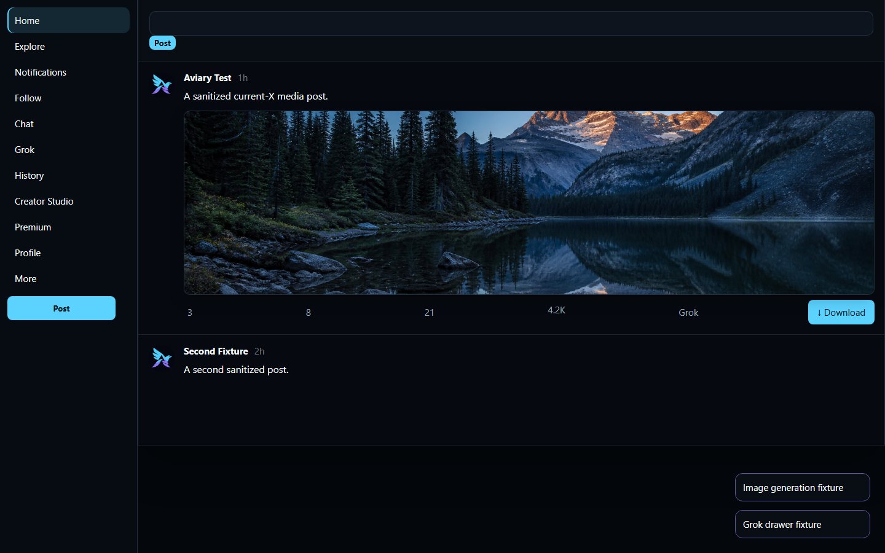
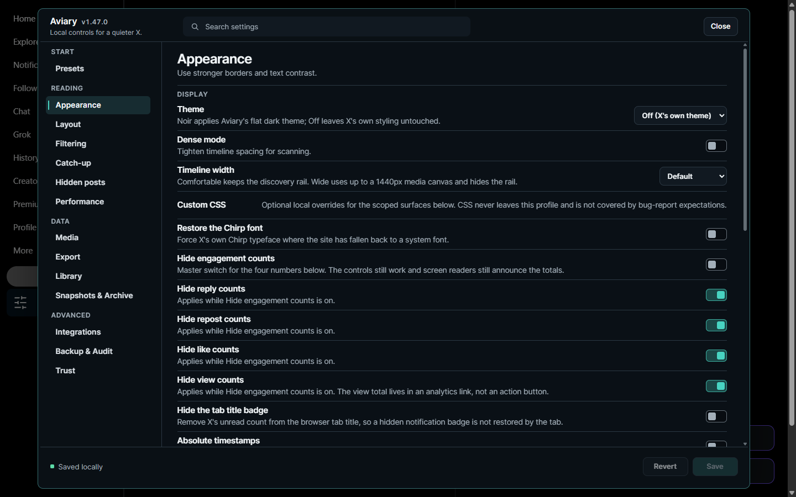
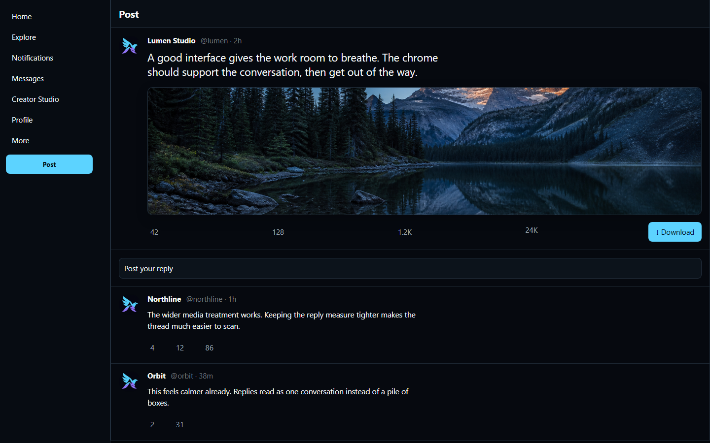

# Aviary




Aviary is a local-first enhancer for X. It saves photos and video in one click, takes the ads out of
the timeline, and keeps everything else behind a Control Center you open from X's own sidebar. One
TypeScript source builds two artifacts: a readable userscript, and a Manifest V3 extension for
Chrome and Firefox.

Nothing it does needs a server. There's no account, no telemetry, no remote code, and no build step
that reaches the network at runtime. Your posts, notes, bookmarks and download history stay in your
browser profile, and the optional integrations that can reach the internet are all off until you
turn one on and enter your own credentials.

## Install

Aviary isn't in any extension store. You load it yourself, which is the trade for a build you can
read end to end. Full steps for all three paths, plus how to uninstall, are in
[docs/INSTALL.md](docs/INSTALL.md).

- **Userscript.** Point Tampermonkey or Violentmonkey at
  [`dist/aviary.user.js`](dist/aviary.user.js). Your manager polls the same URL for updates.
- **Chrome or Edge.** Run `npm run build`, then load `dist/extension-chrome/` unpacked from
  `chrome://extensions` with developer mode on.
- **Firefox.** Build, then load `dist/extension-firefox/manifest.json` as a temporary add-on from
  `about:debugging`.

The build also writes `dist/extension-chrome-v<version>.zip` and its Firefox twin. They're packaged
for upload, but nothing has been submitted anywhere. The Firefox manifest still carries a
placeholder add-on id, so an AMO submission would need a real one first.

## What a fresh install actually does

Two things are on out of the box, and everything else waits for you.

**Ads come out.** At document start, in both builds, Aviary stops X's separable
`promoted_content/log.json` event from reaching the network, removes native Ad units and promoted
trends and house promos, then collapses the timeline row so you don't get a dead gap where the ad
was. It leaves HomeTimeline alone, because X delivers sponsored records inside the same first-party
response as ordinary posts, and those bytes can't be separated. Only the rendering can.

**Media saves are ready.** Every post with media grows one Download action that takes the photos,
video, GIF, audio track and caption file belonging to that post. Quoted media and link-card previews
keep their own separate Save control, filed under the account that actually published them, because
they belong to somebody else. History is stored as hashed media identities rather than source URLs,
so it catches alternate X image sizes and exact byte matches without keeping a list of what you
looked at. Batch downloads re-check queued video targets after pacing, so a higher-quality URL
observed before handoff is the one persisted and requested. If a tab or service worker restarts,
Resume checks the browser's retained transfer before retrying, so an active or completed file is
not duplicated.

That's the whole default surface. Themes, layout cleanup, filters, offscreen video pausing and the
broader analytics refusal all start off. Outside the download controls, the only thing Aviary adds
to the page is its launcher in X's left navigation.

This is measured rather than asserted. `tests/vanilla-by-default.test.mjs` mounts the real theme
code against a captured organic timeline with default settings and requires every non-ad computed
style to come back byte-identical. Ad fixtures separately prove the structural removal.

## The Control Center



Fourteen destinations share one desktop layout with a fixed rail, grouped navigation and explicit
dependencies between controls. Changes sit in a page draft until you hit Save, so a half-configured
page never reaches the timeline. Revert puts the saved values back, and navigating away while a
draft is open is guarded. It's verified at 1440x900 with a 1920x1080 wide check.

Changed your mind about all of it? **Trust → Reset everything to plain X** returns preferences to
the ad-free baseline. Saved posts, notes, bookmarks and download history are kept.

## Noir



**Appearance → Theme → Noir** repaints the full X shell: a near-black blue base, a continuous flat
timeline, a quieter navigation rail, restrained cyan highlights. It anchors on semantic roles and
stable test ids instead of X's generated class names, and it avoids page-wide blur on an infinite
timeline.

Width has two desktop tiers. Comfortable keeps X's discovery rail beside a 1000px reading column.
Wide drops the rail and fills every pixel next to navigation, while text stays capped at a readable
measure. All six authored dark palettes repaint correctly even when X itself is set to a light host
theme, and choosing **Off (X's own theme)** removes every paint hook Aviary added.

## Everything else

The full reference lives in [docs/FEATURES.md](docs/FEATURES.md). The short version:

- **Filtering.** Keyword and regex rules, media-type filters, a handle whitelist, per-route
  activation, expiry windows, and portable plain-text rule sets you can preview before applying.
- **Hidden posts.** A Hide control on every post that collapses the row for good, with undo.
- **Catch-up.** A bounded local digest of posts Aviary already rendered, by hour window. It never
  marks anything read and never asks X for a timeline it wasn't given.
- **Reading position.** One saved position per feed surface, a "New since you last looked"
  separator, and no unread badge anywhere.
- **Export.** JSON, CSV, HTML, Markdown and XLSX bundled into a ZIP with per-file checksums, plus a
  local viewer with virtualized scrolling and reconstructed thread reading.
- **Preservation.** WARC record streams and WACZ 1.1.1 packages that open directly in
  [replayweb.page](https://replayweb.page/), with an optional anonymous ECDSA signature.
- **Library.** Local bookmarks with tags and folders, per-handle account notes, t.co unshortening
  with no network call, snapshots, X archive import, and one search that ranks across all of it.
- **Backups.** One versioned envelope covering every profile, not just the one you have open.
  Credentials are excluded unless you explicitly ask for them, and schema 1 and 2 files remain
  readable under their historical checksum rules.
- **Integrations.** Aria2 handoff, Bluesky and Mastodon crossposting, semantic search. Every one is
  off by default and makes zero requests until you enable it and supply your own credentials.
- **Local AI command menu (off by default).** Enable it in Integrations and each post's action row
  gains an AI button offering Translate, Summarize, Explain or Fact-check. On its own it only builds
  a prompt and copies it to your clipboard, with no network call and no API key. Configuring the
  separate provider runner is what lets the same menu POST a prompt, and only after an explicit
  per-request disclosure.

## Privacy

Aviary reads the page you're already looking at. It never reads or exports cookies or auth headers,
sends no telemetry, and loads no remote code. Credentials for the optional integrations stay local,
and a settings export replaces them with a placeholder.

In the extension build, durable settings and library records live in one IndexedDB database owned by
the background worker. Content scripts and the options page reach it through a typed message API, so
scripts running on the X page can't inspect it. The userscript never opens an X-origin database at
all. Writes from two open X tabs merge at the storage transaction, so a later save does not erase a
non-conflicting change or bring back something the other tab cleared.

Provider calls, when you've enabled one, show you the destination, the fields, an estimated size, a
retention notice and your remaining budget before any work begins. Per-request and daily byte limits
stop a call before it leaves the browser.

One thing Aviary deliberately does not offer is local encryption. Its data sits in the same browser
profile as X's own session cookie, auth token and cached media, none of which Aviary can encrypt and
all of which matter more than its copy. Use full-disk encryption instead, which covers the lot.

Aviary also leaves sensitive media alone. It can't reliably tell those posts from any other post, so
X's own filter is left to do that job.

The full local data map is in [docs/PRIVACY.md](docs/PRIVACY.md).

## When something breaks

X changes its markup often, and the symptom is usually "something on Home looks wrong" rather than
which of thirty-odd features caused it. **Trust → Find the feature breaking this page** answers that
by binary search. It turns everything off, brings features back in halves, asks after each round
whether the page is still wrong, and names the culprit in about five rounds.

Turning a feature off runs its own `destroy`, the same teardown a full unload performs. Nothing is
written to settings, so reloading restores everything no matter how you stop, including closing the
tab mid-round. If the first round leaves the page still broken with everything off, the search says
so instead of blaming whichever feature the halving happened to land on.

## Build from source

```powershell
npm ci --ignore-scripts
npm run verify
```

`verify` chains a TypeScript check, pinned ESLint, the full test suite, an esbuild bundle and a
preflight gate. That gate is where the project's rules are actually enforced: manifest version has
to match `package.json`, `host_permissions` can't be `<all_urls>`, no bundle may contain `eval` or
`new Function`, devDependencies must be exact-pinned, and `innerHTML` is banned outside the
TrustedTypes helper.

Aviary has zero runtime dependencies, so nothing it ships needs an install script to build or run.
`--ignore-scripts` closes the install-hook attack class here at no cost, and the full suite passes
on a clean install without them. That's not blanket protection and pretending otherwise would be the
kind of claim this project fails its own build over. Several 2026 compromises put the payload in the
module body, where no install flag reaches. What covers those is having no runtime dependencies and
installing from a committed lockfile.

Node 22.23.2 or newer is required. The `engines` range names supported lines explicitly rather than
using an open `>=`, which would admit Node 25.x after its end of life.

Development tests import the TypeScript sources directly through Node's native type stripping. The
release build still bundles the userscript and extension artifacts.

```powershell
npm run smoke   # packaged-extension request-rule probes in Chromium and Firefox
```

Smoke needs a Chromium runner and a normal Firefox install. Every lane uses a throwaway profile,
every provider call goes to a local stub, and each run cleans up after itself. Without those
browsers the scripts exit with a setup message rather than a failure.

## Selector captures

`_decoded/*.html` is the only ground truth for X's DOM in this repository. A selector ships when a
capture proves it, which makes those files the authority, and an authority needs a date.
`_decoded/captures.json` records each capture's date, route and provenance and declares a ceiling in
days. Preflight warns, then fails, once a capture is past it.

Refreshing needs a signed-in operator saving the page as MHTML. Nothing in this repository logs in
or fetches anything. The decode step scrubs `ct0`, Bearer and `auth_token` shaped values in both
cookie and JSON form, and refuses to write a file that still trips its own leak guard. The captures
are tracked, so anything left in them is published to anyone who can read the repository. Scope them
to what a selector needs.

## Roadmap

Open work is tracked in [ROADMAP.md](ROADMAP.md), and what each release actually changed is in
[CHANGELOG.md](CHANGELOG.md). This section doesn't restate either one, because a hand-maintained
summary of the newest batch is exactly what went three releases stale before. Work that's waiting on
a fresh capture or an operator decision sits in [Roadmap_Blocked.md](Roadmap_Blocked.md).

## Documentation

| File | What's in it |
| --- | --- |
| [docs/INSTALL.md](docs/INSTALL.md) | Setup for all three paths, and uninstall |
| [docs/FEATURES.md](docs/FEATURES.md) | Every Control Center section in detail, and the source map |
| [docs/PRIVACY.md](docs/PRIVACY.md) | Local data map and optional permission notes |
| [docs/FAQ.md](docs/FAQ.md) | Selector-regression workflow, hotkey policy, export tips |
| [ROADMAP.md](ROADMAP.md) | Actionable open work |
| [Roadmap_Blocked.md](Roadmap_Blocked.md) | Work waiting on a capture or an operator decision |
| [CHANGELOG.md](CHANGELOG.md) | What each release changed |

## Contributing

Issues and pull requests are welcome. A few things will save you a round trip:

- `npm run verify` has to pass. It's the same gate CI would run if this repository had CI.
- No `innerHTML`, no `insertAdjacentHTML`, no keyboard shortcuts, no `backdrop-filter`. Both
  `tools/preflight.mjs` and `tests/source-contracts.test.mjs` fail the build on those.
- Every feature has to fully reverse itself in `destroy`. That's what makes the bisect search and
  the reset action trustworthy.
- A new selector needs a capture that proves it.
- Version strings live in `package.json`, both extension manifests, the README badge, `ROADMAP.md`
  and `CHANGELOG.md`. They move together.

## License

MIT. See [LICENSE](LICENSE).

Aviary is not affiliated with, endorsed by, or connected to X Corp. "X" and "Twitter" are
trademarks of their respective owners.
